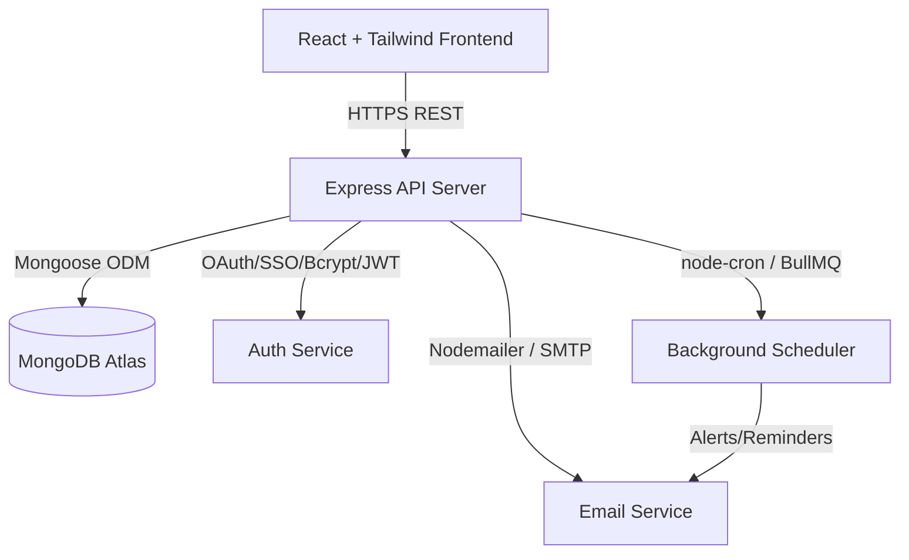

# UniSphere – Implementation Project Plan

This document outlines the architecture, development roadmap, folder structure, module dependencies, implementation order, and a detailed TODO checklist for building the **UniSphere – Smart Campus Events & Clubs Hub** using the MERN stack.

---

## 1. Architecture Summary

UniSphere is designed as a modular MERN stack application utilizing a secure, decoupled frontend-backend communication flow:



### Key Subsystems:
*   **Authentication & Session Management**:
    *   Passwords hashed using `bcrypt` (rounds: 10).
    *   Dual-token model: short-lived JSON Web Tokens (JWT) for access (in-memory) and long-lived database-backed refresh tokens (sent via `httpOnly` secure cookies with rotation).
*   **Core Domain Entities**: Clubs, Events, Registrations, Attendance, Notifications, and Recommendations.
*   **Intelligent Personalization (AI)**: Interest-matching recommendation engine aligning user interest tags (e.g. `["AI", "web"]`) with event category tags, outputting sorted feeds.
*   **QR Check-in**: Signed time-bound tokens generated for registered users. Organizers use their scanning interface to hit the backend verification endpoints, preventing double-entry and fraud.
*   **Asynchronous Messaging**: Background job queue for event alerts (24 hours and 1 hour before scheduled start) and email notification batching.

---

## 2. Folder Structure for MERN Project

This project is organized as a workspace monorepo layout, separating the client-side single page app (SPA) from the Express API:

```
/unisphere
  /client                         # React SPA (Vite + TailwindCSS)
    /src
      /assets                     # Logos, placeholder banners
      /components                 # Reusable UI elements (Button, Input, Card, Modal)
      /context                    # State providers (AuthContext, Socket/NotificationContext)
      /hooks                      # Custom hooks (useAuth, useFetch, useQRScanner)
      /layouts                    # Page wrappers (DashboardLayout, AuthLayout)
      /pages                      # Full views (Home, Login, Register, EventDetails, ClubDashboard)
      /routes                     # Client-side routing with Guard components
      /services                   # Axios configuration and API request wrappers
      /styles                     # Tailwind directives and CSS definitions
      /utils                      # Client-side helper functions
  /server                         # Express API (Node.js + Mongoose)
    /src
      /config                     # Database connections, Logger, JWT configs, Env validations (Zod)
      /controllers                # Express route controllers mapping req/res
      /jobs                       # Background schedulers (node-cron / BullMQ workers)
      /middlewares                # Auth verify, RBAC checks, rate limiters, central error handlers
      /models                     # Mongoose collection schemas
      /routes                     # Endpoint router mappings grouped by domain
      /services                   # Complex logic (Auth service, Mailer service, Recommendation scorer)
      /utils                      # Encryption, Token Generators, Date formatting helpers
      app.js                      # Express App initialization
      server.js                   # Server entrypoint and MongoDB connector
  /docs                           # UniSphere architecture, PRD, and TDD specifications
  package.json                    # Monorepo workspaces definition
```

---

## 3. Module Dependencies

### Server Dependencies
*   **Core**: `express`, `mongoose` (MongoDB Atlas connectivity)
*   **Security**: `jsonwebtoken` (JWT creation/verifying), `bcryptjs` (password encryption), `cors` (cross-origin controls), `helmet` (HTTP headers security), `express-rate-limit` (endpoint throttling)
*   **Validation**: `zod` or `joi` (strict request body checking)
*   **Jobs & Communications**: `nodemailer` (transactional emails), `node-cron` or `bullmq` (background scheduling)
*   **Utility & Dev**: `dotenv` (environment variables), `morgan` (HTTP logging), `winston` (structured logs), `nodemon` (dev hot reloading)

### Client Dependencies
*   **Core**: `react`, `react-dom`, `react-router-dom` (routing)
*   **State & Fetching**: `axios` (requests), `zustand` (global client state)
*   **Styling**: `tailwindcss`, `postcss`, `autoprefixer`, `lucide-react` (icon library)
*   **QR scanner**: `html5-qrcode` or custom canvas parser

---

## 4. Development Roadmap & Recommended Implementation Order

To ensure a functional system at each step, development is staged from low-dependency database setups up to analytics and machine learning:

1.  **Stage 1: Foundational Setup (Database & Security)**
    *   Initialize database models (`User`, `RefreshToken`).
    *   Auth flow: password hashing, signup, login, cookie rotation, token validation middleware.
2.  **Stage 2: Club & Event Management**
    *   Implement club listings, memberships, and role assignments (`Club`).
    *   Enable event creation, draft statuses, and admin moderation reviews (`Event`).
3.  **Stage 3: Registration & Dynamic QR Entry**
    *   User registrations, capacity bounds checks, and automatic waitlisting (`Registration`).
    *   Verify tokens and check-in attendee entries (Mongoose transaction safe) (`Attendance`).
4.  **Stage 4: Communication Engine**
    *   In-app notifications feed (`Notification`).
    *   Nodemailer transactional templates and background scheduler for email alerts.
5.  **Stage 5: Intelligent Layer (AI & Analytics)**
    *   Interest tagging scoring mechanism for personalized events recommendation.
    *   Attendance forecasting logic (heuristics on club history + categories).
    *   Analytics dashboards for club organizers and administrators.

---

## 5. Comprehensive TODO Checklist

### Phase 1: Environment Setup & Core Foundations
- [ ] Initialize git repository and set up `/client` and `/server` workspace directories
- [ ] Setup Express backend shell with database connectivity (Mongoose + Atlas string verification)
- [ ] Create Mongoose schemas:
  - [ ] `User` schema (email, name, role enums, interests, profile data)
  - [ ] `RefreshToken` schema (JWT IDs, rotation references, TTL configurations)
- [ ] Implement JWT Auth Middleware (header verification, payload decoding, route protection hooks)
- [ ] Implement Session endpoints:
  - [ ] `POST /auth/register` (hashing password via Bcrypt, default interest mappings)
  - [ ] `POST /auth/login` (issuing JWT access and setting `httpOnly` secure refresh cookies)
  - [ ] `POST /auth/refresh` (refresh token rotation, old token revocation check)
  - [ ] `POST /auth/logout` (invalidating active refresh token from DB)
  - [ ] `GET /users/me` & `PATCH /users/me` (profile editing & interest updates)
- [ ] Integrate Request Validation (Zod middleware) on all auth endpoints

### Phase 2: Club Directories & Roles
- [ ] Create Mongoose `Club` schema (admins, category tag, member sub-documents)
- [ ] Implement Club endpoints:
  - [ ] `POST /clubs` (creation, restricted to Faculty/Admin)
  - [ ] `GET /clubs` (querying, search and filter options)
  - [ ] `GET /clubs/:clubId` (detailed profile view)
  - [ ] `POST /clubs/:clubId/join` (request membership)
  - [ ] `PATCH /clubs/:clubId/members/:userId` (role elevation: Owner, Officer, Member)

### Phase 3: Event Core Lifecycle & Approval Workflow
- [ ] Create Mongoose `Event` schema (schedule start/end, mode offline/online, status tracker, organizers)
- [ ] Implement Event creation and editing:
  - [ ] `POST /events` (creates draft event, links creator as organizer)
  - [ ] `PATCH /events/:eventId` (updates draft/published details, triggers alerts if changes occur post-publish)
- [ ] Implement Event Discovery:
  - [ ] `GET /events` (paginated list of approved/published events, searchable by query and tag)
  - [ ] `GET /events/:eventId` (hydrated detailed event data)
- [ ] Implement Moderation Workflow:
  - [ ] `POST /events/:eventId/submit` (draft -> pending approval state)
  - [ ] `POST /events/:eventId/review` (admin approval/rejection with feedback note)

### Phase 4: Event Registration, Capacity & Waitlist
- [ ] Create Mongoose `Registration` schema (eventId, userId, status registered/waitlisted)
- [ ] Implement Booking Logic:
  - [ ] `POST /events/:eventId/registrations` (checks capacity, registers user or adds to waitlist)
  - [ ] `DELETE /registrations/:registrationId` (unregisters user, triggers auto-promotion of next waitlisted user)
  - [ ] `GET /registrations/me` (lists student's own upcoming bookings)

### Phase 5: QR Validation & Attendance Logging
- [ ] Create Mongoose `Attendance` schema (eventId, userId, checkIn method, scannedBy reference)
- [ ] Implement Pass Generation:
  - [ ] `GET /events/:eventId/checkin/token` (yields short-lived signed JWT check-in token for student)
- [ ] Implement Checking-in:
  - [ ] `POST /events/:eventId/attendance/checkin` (organizer-scanned endpoint, verifies signature, upserts Attendance, increments counters)
  - [ ] `POST /events/:eventId/attendance/manual` (organizer manual bypass with audit logs)
  - [ ] `GET /events/:eventId/attendance` (list attendee check-ins for analysis)

### Phase 6: Notification Inbox & Scheduled Reminders
- [ ] Create Mongoose `Notification` schema (channels email/push, title, readStatus)
- [ ] Setup transactional SMTP mailer configurations via Nodemailer
- [ ] Implement in-app notifications inbox:
  - [ ] `GET /notifications/me` (fetch personal unread events notifications)
  - [ ] `POST /notifications/:notificationId/read` (mark message as read)
- [ ] Setup Background Job scheduler (node-cron):
  - [ ] Schedule hourly task searching events starting in exactly 24 hours & 1 hour
  - [ ] Batch send pre-formatted email reminders to registered students

### Phase 7: Personalization (AI) & Analytics
- [ ] Create Mongoose `Recommendation` schema (ranked item arrays, computed version)
- [ ] Implement Interest Matcher recommendation calculation:
  - [ ] Compare User interest tags against upcoming Events tags.
  - [ ] Calculate recommendation score (Jaccard similarity/overlap + hotness decay).
  - [ ] Store top results in `recommendations` collection.
  - [ ] Expose `GET /recommendations/me` for student personalized feeds.
  - [ ] Expose `POST /recommendations/feedback` to track likes/clicks for future ML adjustments.
- [ ] Implement Aggregated Dashboards:
  - [ ] `GET /analytics/events/:eventId` (registrations-to-attendance rate, peak check-in time)
  - [ ] `GET /analytics/clubs/:clubId` (number of events hosted, average attendance index)
- [ ] Implement Forecasting Baseline Model:
  - [ ] `POST /analytics/events/:eventId/forecast` (calculates confidence score based on club's historic conversion rate, day of week, and event category)
